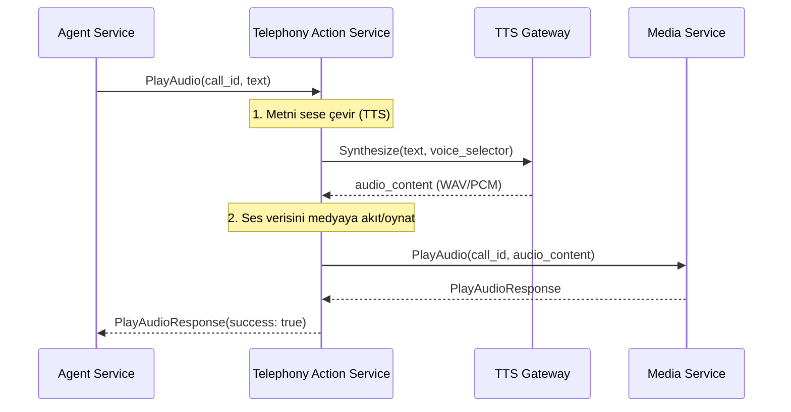
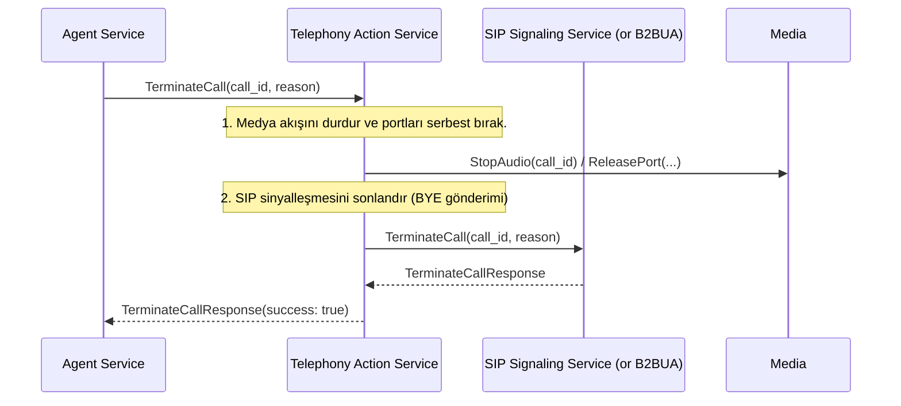

# 📞 Sentiric Telephony Action Service - Mantık ve Akış Mimarisi

**Stratejik Rol:** Agent'tan gelen yüksek seviyeli eylem komutlarını (Play Audio, Start Recording) alır ve bu eylemleri gerçekleştirmek için TTS, Media ve Signaling servislerini koordine eden basitleştirilmiş bir arayüz sağlar. Agent, karmaşık protokol ve medya yönetiminden kurtulur.

---

## 1. Temel Akış: Ses Çalma (PlayAudio)

## 2. Temel Akış: Çağrı Sonlandırma (TerminateCall)

