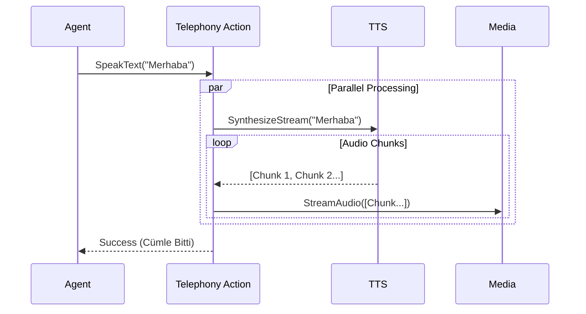

# 📞 Sentiric Telephony Action Service - Mantık Mimarisi (Final)

**Rol:** İcra Memuru. Yüksek seviyeli "Konuş" emrini, düşük seviyeli "Stream" işlemine çevirir.

## 1. Görev Akışı (SpeakText)

Agent servisi sadece "Merhaba de" der. Bu servis şu karmaşık işi yapar:

1.  **Sentez (TTS):** Metni `tts-gateway`'e gönderir.
2.  **Akış (Stream):** TTS'ten gelen ses parçalarını (chunks) anlık olarak yakalar.
3.  **İletim (Media):** Yakaladığı parçaları `media-service`'in gRPC kanalına basar.
4.  **Senkronizasyon:** Cümle bitene kadar Agent'ı bekletir (Block), bitince "Tamam" döner.

## 2. Akış Diyagramı

---
