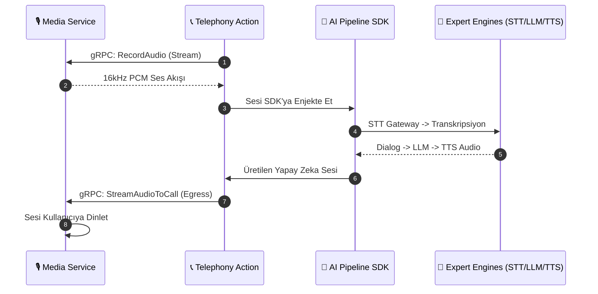

# 🧬 Telephony Action Logic & AI Pipeline Bridging

Bu belge, SIP dünyasından gelen RTP paketlerinin AI Pipeline'a nasıl aktarıldığını ve çift yönlü senkronizasyonun nasıl sağlandığını açıklar.

## 1. Full-Duplex AI Pipeline
`telephony-action-service`, SIP ağından gelen sesi Yapay Zeka motorlarına ulaştıran ana köprüdür. Bu işlemi `sentiric-ai-pipeline-sdk` kütüphanesini ayağa kaldırarak yapar.

## 2. Ses Akış Mimarisi (Diyagram)

```mermaid
sequenceDiagram
    autonumber
    participant Media as 🎙️ Media Service
    participant TAS as 📞 Telephony Action
    participant SDK as 🧠 AI Pipeline SDK
    participant AI as 🤖 Expert Engines (STT/LLM/TTS)

    TAS->>Media: gRPC: RecordAudio (Stream)
    Media-->>TAS: 16kHz PCM Ses Akışı
    TAS->>SDK: Sesi SDK'ya Enjekte Et
    SDK->>AI: STT Gateway -> Transkripsiyon
    AI-->>SDK: Dialog -> LLM -> TTS Audio
    SDK->>TAS: Üretilen Yapay Zeka Sesi
    
    TAS->>Media: gRPC: StreamAudioToCall (Egress)
    Media->>Media: Sesi Kullanıcıya Dinlet
```

## 3. Deadlock Guard (Kilitlenme Koruması)
`media-service`'e yapılan asenkron stream çağrıları (`stream_audio_to_call`) asla ana thread'i bloklamamalıdır. Rust tarafında bu işlem `tokio::spawn` ile arka plana atılır. Eğer AI motoru 10 saniye boyunca hiç ses üretmezse, kaynak sızıntısını önlemek için stream otomatik olarak zaman aşımına uğrar ve kapatılır.
