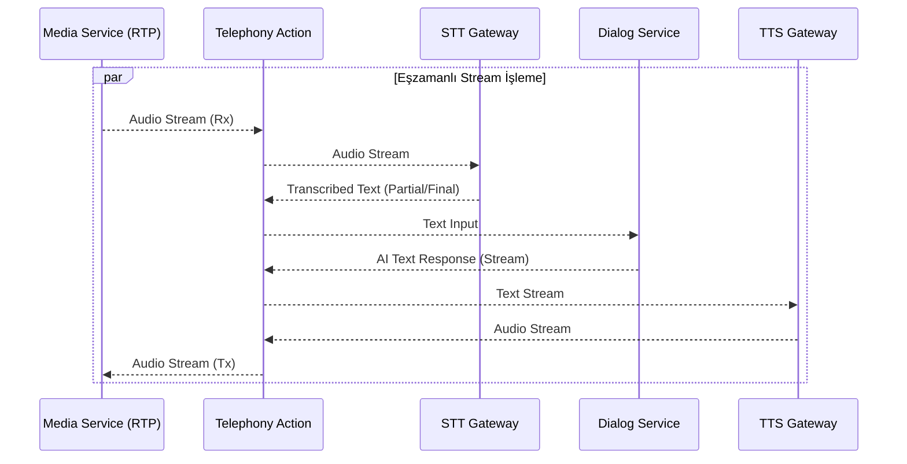

# 📞 Sentiric Telephony Action Service - Mantık Mimarisi (v3.0)

**Rol:** Ağır İşçi / Boru Hattı Yöneticisi (Pipeline Manager).
Agent Service'ten aldığı yüksek seviyeli emirleri (Örn: "AI Döngüsünü Başlat"), düşük seviyeli Gateway stream'lerine çevirir.

## 1. Görev Akışı (RunPipeline - Full Duplex)

Bu servis, platformun en yoğun akan (Streaming) verilerini koordine eder. Bir `RunPipeline` emri geldiğinde şu asenkron mimariyi kurar:

```mermaid
sequenceDiagram
    participant Media as Media Service (RTP)
    participant TAS as Telephony Action
    participant STT as STT Gateway
    participant Dialog as Dialog Service
    participant TTS as TTS Gateway

    par Eşzamanlı Stream İşleme
        %% İçe Akış (Duyma)
        Media-->>TAS: Audio Stream (Rx)
        TAS-->>STT: Audio Stream
        STT-->>TAS: Transcribed Text (Partial/Final)
        
        %% Beyin (Düşünme)
        TAS-->>Dialog: Text Input
        Dialog-->>TAS: AI Text Response (Stream)
        
        %% Dışa Akış (Konuşma)
        TAS-->>TTS: Text Stream
        TTS-->>TAS: Audio Stream
        TAS-->>Media: Audio Stream (Tx)
    end
```

## 2. Kritik Özellikler

1.  **Barge-in (Söz Kesme) Mantığı:** STT Gateway'den gelen seste "Kullanıcı konuşuyor" sinyali (Partial Transcript) alındığında, TAS derhal TTS'ten Media'ya giden akışı keser (Cancel Context). Böylece AI susar ve dinlemeye başlar.
2.  **Agnostik Gateway Kullanımı:** Hangi LLM (Llama/Gemini) veya hangi STT (Whisper/Deepgram) kullanıldığını bilmez. Sadece Standart Sentiric Protobuf kontratları üzerinden `*-gateway-service`'leri ile konuşur.
3.  **Media İzolasyonu:** RTP paketlerine veya UDP soketlerine dokunmaz. Media Service ile gRPC stream üzerinden ham PCM ses verisi alıp verir.

---
