# 📞 Sentiric Telephony Action Service - Mantık ve Akış Mimarisi

**Stratejik Rol:** Agent'tan gelen yüksek seviyeli eylem komutlarını (Play Audio, Start Recording) alır ve bu eylemleri gerçekleştirmek için TTS, Media ve Signaling servislerini koordine eden basitleştirilmiş bir arayüz sağlar. Agent, karmaşık protokol ve medya yönetiminden kurtulur.

---

## 1. Temel Akış: Ses Çalma (PlayAudio)

```mermaid
sequenceDiagram
    participant Agent as Agent Service
    participant TAS as Telephony Action Service
    participant TTS as TTS Gateway
    participant Media as Media Service

    Agent->>TAS: PlayAudio(call_id, text)
    
    Note over TAS: 1. Metni sese çevir (TTS)
    TAS->>TTS: Synthesize(text, voice_selector)
    TTS-->>TAS: audio_content (WAV/PCM)
    
    Note over TAS: 2. Ses verisini medyaya akıt/oynat
    TAS->>Media: PlayAudio(call_id, audio_content)
    Media-->>TAS: PlayAudioResponse
    
    TAS-->>Agent: PlayAudioResponse(success: true)
```

## 2. Temel Akış: Çağrı Sonlandırma (TerminateCall)

```mermaid
sequenceDiagram
    participant Agent as Agent Service
    participant TAS as Telephony Action Service
    participant Signaling as SIP Signaling Service (or B2BUA)
    
    Agent->>TAS: TerminateCall(call_id, reason)
    
    Note over TAS: 1. Medya akışını durdur ve portları serbest bırak.
    TAS->>Media: StopAudio(call_id) / ReleasePort(...)
    
    Note over TAS: 2. SIP sinyalleşmesini sonlandır (BYE gönderimi)
    TAS->>Signaling: TerminateCall(call_id, reason)
    Signaling-->>TAS: TerminateCallResponse
    
    TAS-->>Agent: TerminateCallResponse(success: true)
```

